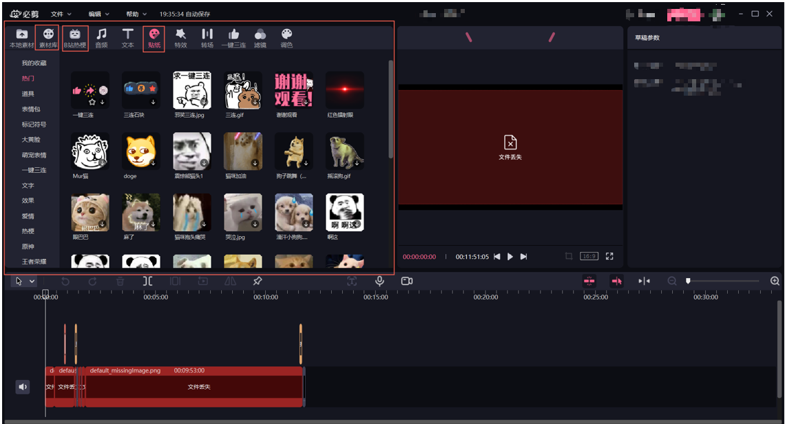

# adobe-cep

#### Description
The development method of this plug-in is CEP of Adobe family, and it obtains materials from Adobe Primere Pro. Currently, the following functions are tentatively required
1. Obtain stickers and other materials in the required software
2. Show the content like bijian software
3. Users can download materials (global)
4. You can drag the downloaded resources to the material box. If the downloaded resources have not been downloaded before, click Download Material

#### Software Architecture
1. Based on CEP platform, JavaScript+Html+Css

#### Installation

1.  wair for ready

#### Instructions

1.  wait for ready

#### Contribution

1.  Fork the repository
2.  Create Feat_xxx branch
3.  Commit your code
4.  Create Pull Request