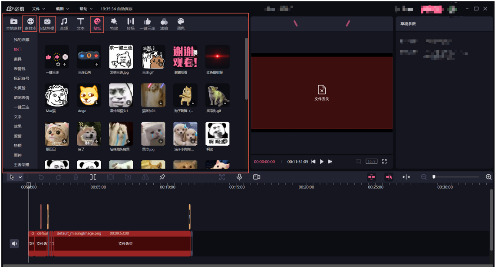

# adobe-cep

#### 介绍

本插件的开发方式为Adobe家族的CEP，对B站推出的剪辑工具必剪进行素材获取，展现在Adobe Primere Pro项目中，方便拉取。目前是基于Adobe Primere Pro
2022进行开发和测试，如果各位需要在其他Adobe宿主应用调试，请调整./public/CSXS/manifest.xml配置（[配置说明](http://blog.nullice.com/%E6%8A%80%E6%9C%AF/CEP-%E5%BC%80%E5%8F%91%E6%95%99%E7%A8%8B/%E6%8A%80%E6%9C%AF-CEP-%E5%BC%80%E5%8F%91%E6%95%99%E7%A8%8B-Adobe-CEP-%E6%89%A9%E5%B1%95%E5%BC%80%E5%8F%91%E6%95%99%E7%A8%8B-%E3%80%8C-1-%E3%80%8DHello-World/)）。

目前暂定需要完成如下功能

1. 获取必剪软件中的贴纸、等素材内容
2. 将内容类似必剪软件中进行展现
3. 用户可以下载素材（全局的）
4. 单击某个素材时，若之前未下载则下载素材，已经下载则打开素材所在文件夹。（或者可以直接支持拖动到素材箱）



#### 软件架构

1. 基于VUE+Element框架，实现前端UI功能
2. 基于Adobe CEP平台以及jsx脚本，实现对Adobe宿主应用API调用

#### 编译教程

1. 确保机器安装了nodejs软件
2. 拉取本项目

   ```shell
   git clone https://github.com/MainPoser/adobe-cep-bilibili.git
   ```
3. 安装依赖、编译

   ```shell
   cd  adobe-cep-bilibili
   npm install
   npm build
   ```
4. 加载插件
   1. 参见下方的使用说明，编译出来的dist目录相当于下载的插件目录
#### 使用说明

1. 下载Promiere Pro 2022并安装。

2. 下载本插件并解压到C:\Program Files (x86)\Common Files\Adobe\CEP\extensions\com.fba.extension.bilibili目录下（内附安装教程）

3. 修改插件配置（步骤如下）

   1. 打开C:\Program Files (x86)\Common Files\Adobe\CEP\extensions\com.fba.extension.bilibili\CSXS下的manifest.xml（右键，打开方式，记事本就行）

   2. 找到<Host Name="PPRO" Version="[22.0,99.9]" />和<RequiredRuntime Name="CSXS" Version="11.0"/>

   3. 打开安装好的Promiere Pro，打开帮助，关于Promiere Pro查看PR的版本（比如我的是22.0.0版）

   4. 参照版本号修改上述Host配置（例如我的是22.0.0版，即改为22.0）例：<Host Name="PPRO" Version="[22.0,99.9]（主要22.0这个位置得改对要小于等于你的版本号，要保证对应的CEP版本大于9【比如我的是22.0，改成21.9也可以】，后面99.9位置的数字大于等于你的版本就行）

   5. 如果你的PR版本低于2022，则需要修改<RequiredRuntime Name="CSXS" Version="11.0"/>中的Version中的值，具体对应关系查看下图（CEP版本就是CSXS版本）

      | Application   | Host ID   | CC 2019 Version | CC 2020 Version | FY 2020          | FY2021        |
      | ------------- | --------- | --------------- | --------------- | ---------------- | ------------- |
      | Photoshop     | PHSP/PHXS | 20 (CEP 9)      | 21 (CEP 9)      | 22.0 (CEP 10)    | 23.0 (CEP 11) |
      | InDesign      | IDSN      | 14 (CEP 9)      | 15 (CEP 9)      | 16.0 (CEP 10 )   | 16.3(CEP 11)  |
      | InCopy        | AICY      | 14 (CEP 9)      | 15 (CEP 9)      | 16.0 (CEP 10 )   | 16.3(CEP 11)  |
      | Illustrator   | ILST      | 23 (CEP 9)      | 24 (CEP 9)      | 25.0 (CEP 10)    | 25.3(CEP 11)  |
      | Premiere Pro  | PPRO      | 13 (CEP 9)      | 14 (CEP 9)      | 14.4 (CEP 10)    | 15.4(CEP 11)  |
      | Prelude       | PRLD      | 8 (CEP 9)       | 9 (CEP 9)       | 10.0(CEP 10)     | 10.1(CEP 11)  |
      | After Effects | AEFT      | 16 (CEP 9)      | 17 (CEP 9)      | 17.1.4 (CEP 10)  | 18.4(CEP 11)  |
      | Animate       | FLPR      | 19 (CEP 9)      | 20 (CEP 9)      | 21.0 (CEP 10)    | 22.0(CEP 11)  |
      | Audition      | AUDT      | 12 (CEP 9)      | 13 (CEP 9)      | 13.0.10 (CEP 10) | 14.4(CEP 11)  |
      | Dreamweaver   | DRWV      | 19 (CEP 9)      | 20 (CEP 9)      | 21.0 (CEP 10)    | 22.0(CEP 11)  |
      | Bridge        | KBRG      | 9 (CEP 9)       | 10 (CEP 9)      | 11.0 (CEP 10)    | 12.0(CEP 11)  |
      | Rush          | RUSH      | 1 (CEP 9)       | 1.2.1 (CEP 9)   | 1.5.29 (CEP 10)  | 2.1(CEP 11)   |

   6. 保存退出

   7. 打开注册表编辑器，打开计算机\HKEY_CURRENT_USER\SOFTWARE\Adobe\CSXS.11（这里的.11取决于你的PR版本，不同的版本对应的数字不一样，参照步骤5的表格）,不存在就创建。检查有没有LogLevel和PlayerDebugMode这两个（多半没有），没有的话右键,新建，字符串值数值都设为1，保存退出。

   8. 此时打开Promiere Pro 2022就可以在窗口，扩展看到bilibili插件了。

#### 目前遇到的问题

1. 部分视频模板、字幕素材下载的文件为特殊格式，不知如何解析
2. 想要做成可以直接拖拽到素材箱的功能，暂时没有思路

#### 参与贡献

1. Fork 本仓库
2. 新建 Feat_xxx 分支
3. 提交代码
4. 新建 Pull Request
